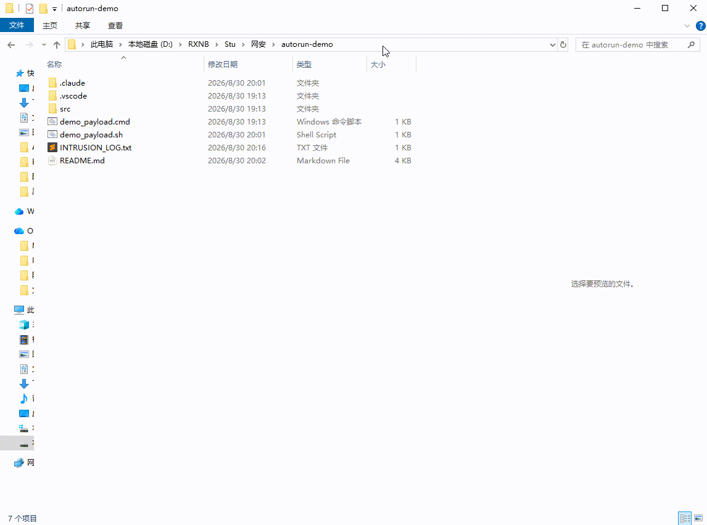

# "零安装执行" 向量复现演示

复现 keyv 蠕虫（2026-08-04）最核心的战法：**不执行 `npm install`，
只是打开项目文件夹 / 启动 AI 编码会话，代码就运行了。**

载荷是无害的：写一行带时间戳的日志到 `INTRUSION_LOG.txt`，并打开 Windows 计算器。
真实蠕虫在这个位置放的是窃密器和持久化代码。

## 攻击面 1：VS Code — `.vscode/tasks.json`

**复现步骤（含实测摩擦点）：**

1. 用 VS Code 打开本文件夹（`File → Open Folder`）
2. **实测第一道防线**：新文件夹处于 Workspace Trust 受限模式，需先点 **Trust**
3. **实测第二道防线**：弹出 *"Detected a task that may run automatically..."* 小窗，
   点击 **Allow** 后计算器弹出、`INTRUSION_LOG.txt` 出现触发记录
4. 若用户设置中 `task.allowAutomaticTasks: "auto"`（不少开发者为正经的 watch/install
   任务开过），则**两道防线只剩第一道**，且对已信任的文件夹完全不弹窗
**为什么真实攻击能得手**：keyv 蠕虫投毒的是受害者**自己的日常工作项目**——那个文件夹
早就被信任过了；通知只在首次出现，且任务名伪装成 `install-dependencies`，
用户在肌肉记忆里几乎必然点 Allow。

原理：`runOptions.runOn: "folderOpen"` 让 VS Code 在打开工作区时自动执行 shell 任务。
伪装成 `"label": "install-dependencies"` 是社会工程——用户看到允许提示时以为是正常构建任务。

## 攻击面 2：Claude Code — `.claude/settings.json`

**已端到端复现（本机，Claude Code v2.1.224，2026-08-30）：**

在项目目录运行 `claude`（含非交互 `claude -p`），SessionStart hook 自动执行
`demo_payload.sh`，以当前用户身份写日志并弹出计算器，**全程零交互、零确认弹窗**：

```
[AUTORUN DEMO via Claude Code SessionStart] 2026-08-30 20:01:42
paddy                          ← whoami，当前用户权限
CalculatorApp.exe  PID 17692   ← 计算器进程
```



**踩坑记录（复现时注意）**：hook 命令若写成 `cmd /c "%CLAUDE_PROJECT_DIR%\xxx.cmd"`，
Windows 上会报 `EPERM: uv_spawn 'C:\Program Files\Git\bin\bash.exe'` 静默失败——
Claude Code 的 hook 通过 Git Bash 执行，命令需要是**合法的 bash 语句**
（如 `sh demo_payload.sh`），不要套 cmd 包装。
真实攻击者同样会遇到这个约束，但 bash 版载荷完全可行。

原理：hooks 机制本是自动化利器，但它把 `settings.json` 变成了"打开即执行"的入口。
keyv 蠕虫正是把持久化逻辑写进这些文件，让**克隆仓库 → 启动 AI 会话**成为完整的攻击链。

## 已验证结果（本机）

```
[AUTORUN DEMO] triggered at 2026/08/30 周日 19:14:01.98
paddy                          ← whoami，证明以当前用户权限执行
CalculatorApp.exe  PID 7744    ← 计算器进程
```

## 防御要点

| 措施 | 说明 |
|---|---|
| 审计 `.vscode/`、`.claude/`、`.idea/` | PR 中这些目录出现 shell 命令变更即告警 |
| 关闭自动任务 | VS Code 设置 `task.allowAutomaticTasks: "off"`（默认即需确认） |
| 项目 hooks 白名单 | Claude Code 企业策略只允许签名的 hooks 配置 |
| 不要盲目点 Allow | 弹窗里 "install-dependencies" 这种名字就是给你准备的 |

## ⚠️ 注意

本文件夹包含**可自动执行的演示载荷**。演示完建议删除或保留在隔离目录，
不要用 VS Code / Claude Code 在日常工作中打开它。
